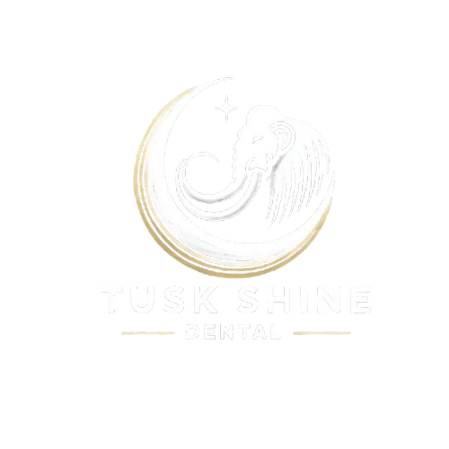

    <h1>🦣✨🦷 Tusk Shine Dental Data Project</h1>
    <strong>Empowering Data-Driven Decisions for Tusk Shine Dental's New Beginning</strong>

    

## **Project Description**  
Tusk Shine Dental is more than just a dental clinic—it's the culmination of decades of experience, adaptability, and passion. Founded by a dedicated dentist with a remarkable journey from Indonesia to Texas, this fictional clinic embodies the pursuit of excellence and compassion in dental care.  

This repository is the starting point for crafting a data-driven strategy to ensure the clinic’s success. Leveraging the **CMS Open Payments dataset**, this project analyzes healthcare industry trends, competitor insights, and market opportunities to guide informed decision-making. The findings will play a key role in shaping Tusk Shine Dental’s service offerings, pricing models, and community engagement initiatives.  

> **Note:**  
> This dental clinic is entirely fictional and created solely for the purpose of this personal data engineering project. Any resemblance to actual businesses is purely coincidental.  

---

## **Goals 🎯**  

This project aims to:  

1. 🔍 **Extract actionable insights** from the CMS Open Payments dataset.  
2. 🌟 **Analyze dental care industry trends** in Texas.  
3. 📊 **Provide data-backed recommendations** for clinic location, services, and pricing.  
4. 🤝 **Identify strategic partnerships** with suppliers and technology providers.  
5. ❤️ **Develop strategies for community engagement** and outreach.  
